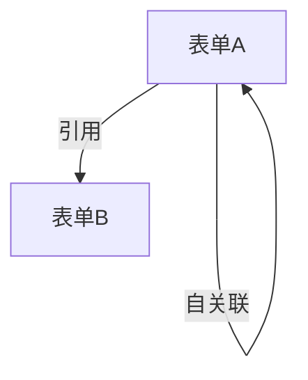

# {项目名称} - 数据结构设计

> 生成时间：{YYYY-MM-DD}
> 依据：`{项目名}/01-需求文档.md`
> 状态：待确认 / 已确认

---

## 一、表结构

### uf_xxx — {表中文名}

| 字段名 | 字段类型 | OA建模类型 | 必填 | 浏览框 | 说明 |
|--------|---------|-----------|------|------|------|
| id | int | - | 是 | - | 主键 |
| {field} | {类型} | {类型} | {是/否} | {如适用} | {说明} |

（每张表单对应一个表，按依赖顺序排列）

---

## 二、浏览框规划

### 2.1 自定义浏览框

| 浏览框名称 | 数据源表 | 链接字段 | 查询字段 | 默认过滤 | 说明 |
|-----------|---------|---------|---------|---------|------|
| {名称} | uf_xxx | {字段} | {字段列表} | {如 is_archived='0'} | {说明} |

### 2.2 系统浏览框引用

| 引用字段 | 系统浏览框 | browser_id | 是否多选 | 说明 |
|---------|-----------|-----------|---------|------|
| {字段名} | {人员/部门/日期等} | {ID} | {是/否} | {说明} |

> 系统浏览框单选/多选使用不同 browser_id（如人员=1，多人力资源=17）。

---

## 三、依赖分析

### 3.1 依赖关系图

### 3.2 环形依赖处理

| 表单 | 环形字段 | 策略 |
|------|---------|------|
| {表单名} | {字段名} | 创建表单时跳过 → 浏览框就绪后 add_fields_to_form 补加 |

### 3.3 字段补加计划

| 表单 | 补加字段 | 依赖的浏览框 | 补加时机 |
|------|---------|------------|---------|
| {表单名} | {字段名} | {浏览框名称} | 所有浏览框创建后 |

---

## 四、执行阶段规划

| 阶段 | 内容 | 依赖前置阶段 |
|------|------|------------|
| Phase 0 | 创建应用 | - |
| Phase 1 | 创建无依赖表单 | Phase 0 |
| Phase 2 | 创建自定义浏览框 | Phase 1 |
| Phase 3 | 创建依赖表单（含跳过字段） | Phase 2 |
| Phase 4 | 补加跳过字段 | Phase 3 |
| Phase 5 | 创建模块 | Phase 0 |
| Phase 6 | 创建查询列表 | Phase 5 |
| Phase 7 | 字段联动 | Phase 5 |
| Phase 8 | 创建菜单 | Phase 6 |

---

## 五、特殊说明

- 选择框选项汇总
- 跳过的字段汇总
- 数据库表汇总
