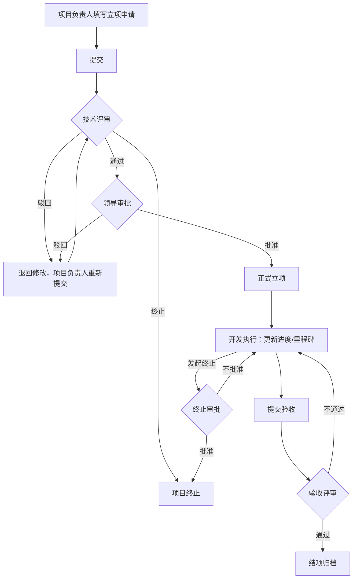

# 科创项目管理 - 需求文档

> 生成时间：2026-08-28
> 方法：AI 语义拆解 + 对话式追问
> 状态：已确认

---

## 一、原始需求

> 用户原话：帮我创建一个泛微二次开发的项目"科创项目管理"，企业内部研发团队管理研发项目。

---

## 二、功能清单

### 2.1 项目库（总览）

**描述：** 所有研发项目的统一管理入口，支持按项目类型、状态、负责人、申请部门等维度筛选。展示项目基本信息、当前阶段、进度概览，提供快速跳转到申报/审批/执行/验收各阶段的入口。

**规则：**
- 列表默认按项目创建时间倒序排列
- 不同角色看到自己权限范围内的项目（项目负责人看自己的，管理员看全部）
- 支持快捷搜索：项目名称、编号、负责人

**验收标准：**
- [ ] 打开项目库页面能看到所有项目的基本信息（名称、编号、类型、状态、负责人、申请部门）
- [ ] 按"开发中"筛选后只展示状态为开发中的项目
- [ ] 项目负责人只能看到自己负责的项目，管理员能看到全部项目

### 2.2 项目申报

**描述：** 项目负责人填写立项申请，包括项目基本信息、背景与目标、技术方案、预算估算和里程碑计划。填写完成后提交进入技术评审流程。支持保存草稿，暂不提交。

**规则：**
- 项目编号系统自动生成（规则：KX + 年月 + 4位序号，如 KX2026080001）
- 项目类型必填，4种：新产品研发、技术预研/攻关、技术改造/优化、工艺改进
- 项目级别必填，2种：公司级、部门级
- 预计开始/结束日期必填，且结束日期必须晚于开始日期
- 里程碑节点至少填写1个（里程碑名称 + 计划完成日期）
- 预算金额必填（可为0）

**验收标准：**
- [ ] 填写完整项目信息后提交，项目状态变为"需求待评审"
- [ ] 保存草稿后项目状态为"草稿"，不出现在审批列表中
- [ ] 项目编号自动生成且不与已有项目重复
- [ ] 结束日期早于开始日期时给出错误提示

### 2.3 技术评审

**描述：** 技术团队（技术总监或指定评审人）对项目的技术可行性、方案合理性进行评审。评审结果分三种：通过、驳回（退回修改）、终止（不建议立项）。

**规则：**
- 评审人收到待办通知，进入评审页面查看项目全部信息和里程碑
- 评审意见为必填文本
- 通过后自动流转到领导审批；驳回后退回给项目负责人修改重新提交
- 终止的项目状态变为"已终止"，不可恢复

**验收标准：**
- [ ] 评审通过后项目状态变为"领导审批中"
- [ ] 驳回后项目状态变回"草稿"，项目负责人能收到通知并修改后重新提交
- [ ] 评审意见为必填项，不填无法提交

### 2.4 领导审批

**描述：** 管理层对通过技术评审的项目做最终决策，决定是否批准立项。

**规则：**
- 审批领导可以看到评审人的技术评审意见
- 审批结果：批准立项、驳回（退回技术评审或项目负责人）
- 批准后项目状态变为"已立项"，进入开发执行阶段
- 驳回时必须注明原因

**验收标准：**
- [ ] 审批通过后项目状态变为"已立项"，项目负责人收到通知
- [ ] 驳回后项目退回给项目负责人，负责人能看到驳回原因
- [ ] 审批领导能看到技术评审意见

### 2.5 开发执行

**描述：** 项目立项后进入开发执行阶段。项目负责人更新项目进度、管理里程碑节点的完成情况、记录项目变更（范围调整、时间延期等）。支持添加项目文档附件。

**规则：**
- 里程碑状态：未完成、已完成、已延期
- 项目整体进度以百分比表示（0-100%）
- 变更记录需包含变更原因、变更内容、影响范围
- 支持上传附件（技术方案、设计文档、代码包等）
- 可发起终止申请（终止后进入终止审批流程）

**验收标准：**
- [ ] 项目负责人能更新每个里程碑的状态和实际完成日期
- [ ] 里程碑实际完成日期晚于计划完成日期时自动标记为"已延期"
- [ ] 能上传附件且附件可在验收时查阅
- [ ] 项目进度百分比能手动更新

### 2.6 验收结项

**描述：** 项目开发完成后，项目负责人提交验收申请，附成果物说明和验收自评。验收评审通过后项目结项归档。

**规则：**
- 验收申请需填写：成果物清单、实际花费、自评总结
- 验收评审人（技术评审人或指定验收人）进行验收
- 验收结果：通过（结项）、不通过（退回继续开发）
- 结项后项目状态变为"已结项"，信息只读归档
- 实际花费与预算偏差超过30%时需要说明原因

**验收标准：**
- [ ] 提交验收后项目状态变为"验收中"
- [ ] 验收通过后项目状态变为"已结项"，所有字段变为只读
- [ ] 验收不通过后项目状态变回"开发中"，负责人收到退回通知
- [ ] 实际花费与预算偏差>30%时必须填写原因说明

### 2.7 项目统计

**描述：** 简易统计看板，按项目类型、状态、负责人、部门等维度统计项目数量和完成率，辅助管理层决策。

**规则：**
- 统计维度：按项目类型分布、按状态分布、按负责人/部门分布
- 展示在研项目数、已结项数、已终止数、整体完成率
- 支持按年度筛选

**验收标准：**
- [ ] 能按项目类型展示饼图或表格统计
- [ ] 能按状态展示各状态项目数量
- [ ] 能按年度筛选查看统计数据
- [ ] 数据与项目库实际数据一致

---

## 三、角色与权限

| 角色 | 能做什么 | 不能做什么 |
|------|---------|-----------|
| 项目负责人 | 申报项目、更新进度、管理里程碑、提交验收、上传附件 | 审批项目、查看非本人负责的项目详情（仅列表可见基本信息） |
| 技术评审人 | 评审项目技术方案、出具评审意见 | 最终审批立项、修改项目信息 |
| 审批领导 | 最终决策立项/终止、查看评审意见 | 评审技术方案、修改项目执行细节 |
| 项目管理员 | 维护项目分类、查看全局统计、分配角色、查看所有项目 | 审批项目、修改项目执行内容 |

---

## 四、业务流程

### 4.1 正常流程

### 4.2 异常处理

| 异常场景 | 处理方式 |
|---------|---------|
| 技术评审被驳回 | 退回项目负责人修改后重新提交，保留历史评审记录 |
| 领导审批被驳回 | 退回项目负责人，负责人可修改后重新提交或直接终止 |
| 开发过程中发现方向不对 | 项目负责人发起终止申请，审批领导批准后终止 |
| 验收不通过 | 退回开发执行阶段继续改进，保留验收意见记录 |
| 里程碑延期 | 系统自动标记延期状态，项目负责人需更新计划日期并说明原因 |
| 项目负责人离职/更换 | 管理员在项目库中变更负责人 |

---

## 五、边界用例

| 场景 | 处理方式 |
|------|---------|
| 多人同时编辑同一个项目 | 后保存者覆盖先保存者，系统提示"数据已被修改，请刷新后重试" |
| 越权访问 | 项目负责人无法查看其他负责人项目详情；评审人只能评审分配给自己的项目 |
| 项目被终止后能否恢复 | 已终止项目不可恢复，如需重启需重新申报 |
| 已结项项目的数据 | 结项后所有字段只读，不可修改或再次提交验收 |
| 预算金额为0的项目 | 允许立项，验收时"实际花费"也填0，不触发偏差校验 |
| 同一人同时负责多个项目 | 允许，项目统计中按人汇总 |
| 草稿状态的项目 | 仅项目负责人可见，不进入任何审批流程，可删除 |

---

## 六、待定项

> 以下为分析阶段提出的待定项，已在对话中确认解决。

| 待定内容 | 确认结果 |
|---------|---------|
| 项目分类 | 4种：新产品研发、技术预研/攻关、技术改造/优化、工艺改进 |
| 审批流程顺序 | 串行：先技术评审，通过后领导审批 |
| 统计看板 | 需要，按类型/状态/负责人/部门统计，支持按年度筛选 |

---

## 七、附录：调研参考

企业内部研发项目管理系统常见模式参考：
- 典型研发管理流程：需求提出 → 立项评审 → 开发执行 → 验收结项，与本次设计一致
- 里程碑管理是研发项目的核心功能，用于跟踪关键交付节点
- 预算与实际偏差分析是管理层关注的重点，本次设计已包含
- 项目文档/成果物附件管理是验收结项的必要支撑
