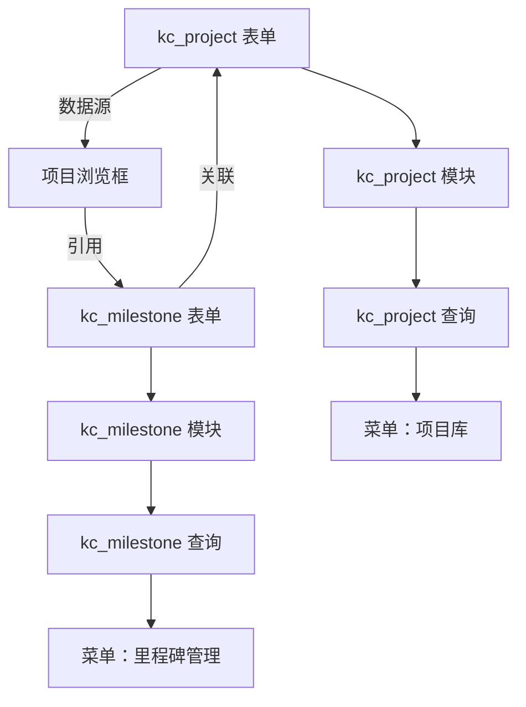

# 科创项目管理 - 数据结构设计

> 生成时间：2026-08-28
> 依据：`科创项目管理/01-需求文档.md`
> 状态：待确认

---

## 一、表结构

### uf_kc_project — 科创项目主表

| 字段名 | 字段类型 | OA建模类型 | 必填 | 浏览框/选项 | 说明 |
|--------|---------|-----------|------|------------|------|
| id | int | - | 是 | - | 主键 |
| project_code | varchar(50) | 单行文本框 | 是 | - | 项目编号（KX+年月+序号） |
| project_name | varchar(200) | 单行文本框 | 是 | - | 项目名称 |
| project_type | varchar(100) | 选择框 | 是 | 新产品研发/技术预研攻关/技术改造优化/工艺改进 | 项目类型 |
| project_level | varchar(100) | 选择框 | 是 | 公司级/部门级 | 项目级别 |
| apply_dept_id | int | 浏览框 | 是 | browser_id=4（部门单选） | 申请部门 |
| project_manager_id | int | 浏览框 | 是 | browser_id=1（人员单选） | 项目负责人 |
| plan_start_date | varchar(10) | 日期浏览框 | 是 | - | 预计开始日期 |
| plan_end_date | varchar(10) | 日期浏览框 | 是 | - | 预计结束日期 |
| project_status | varchar(100) | 选择框 | 是 | 草稿/需求待评审/技术评审中/领导审批中/已立项/开发中/验收中/已结项/已终止 | 项目状态 |
| project_background | text | 多行文本框 | 否 | - | 项目背景与目标 |
| tech_solution | text | 多行文本框 | 否 | - | 技术方案概述 |
| expected_result | text | 多行文本框 | 否 | - | 预期成果 |
| budget_amount | decimal(15,2) | 金额框 | 是 | - | 预算金额（可为0） |
| progress_percent | int | 整数 | 否 | - | 项目进度（0-100） |
| change_record | text | 多行文本框 | 否 | - | 变更记录 |
| actual_cost | decimal(15,2) | 金额框 | 否 | - | 实际花费 |
| cost_deviation_reason | text | 多行文本框 | 否 | - | 预算偏差原因说明 |
| accept_summary | text | 多行文本框 | 否 | - | 验收自评总结 |
| deliverables | text | 多行文本框 | 否 | - | 成果物清单 |
| project_attachment | varchar(500) | 附件上传 | 否 | - | 项目附件 |

### uf_kc_milestone — 项目里程碑表

| 字段名 | 字段类型 | OA建模类型 | 必填 | 浏览框/选项 | 说明 |
|--------|---------|-----------|------|------------|------|
| id | int | - | 是 | - | 主键 |
| project_id | int | 浏览框 | 是 | 自定义浏览框：项目浏览框 | 关联科创项目 |
| milestone_name | varchar(200) | 单行文本框 | 是 | - | 里程碑名称 |
| plan_date | varchar(10) | 日期浏览框 | 是 | - | 计划完成日期 |
| actual_date | varchar(10) | 日期浏览框 | 否 | - | 实际完成日期 |
| milestone_status | varchar(100) | 选择框 | 是 | 未完成/已完成/已延期 | 里程碑状态 |
| delay_reason | text | 多行文本框 | 否 | - | 延期原因说明 |

---

## 二、浏览框规划

### 2.1 自定义浏览框

| 浏览框名称 | 数据源表 | 链接字段 | 查询字段 | 默认过滤 | 说明 |
|-----------|---------|---------|---------|---------|------|
| 项目浏览框 | uf_kc_project | project_name（istitle=1） | project_name（isquery=1）, project_status（isquery=1）, project_code（isquery=1） | project_status<>'草稿' | 里程碑表关联项目时使用，排除草稿状态的项目 |

**项目浏览框字段配置**：

| 字段名 | istitle | isquery | displayorder | 说明 |
|--------|---------|---------|-------------|------|
| project_name | 1 | 1 | 0 | 项目名称，链接字段，支持查询 |
| project_code | 0 | 1 | 1 | 项目编号，支持查询 |
| project_type | 0 | 0 | 2 | 项目类型 |
| project_status | 0 | 1 | 3 | 项目状态，支持查询 |
| project_manager_id | 0 | 0 | 4 | 项目负责人 |

### 2.2 系统浏览框引用

| 引用字段 | 系统浏览框 | browser_id | 是否多选 | 说明 |
|---------|-----------|-----------|---------|------|
| apply_dept_id | 部门（单选） | 4 | 否 | 申请部门 |
| project_manager_id | 人员（单选） | 1 | 否 | 项目负责人 |

---

## 三、依赖分析

### 3.1 依赖关系图

### 3.2 环形依赖处理

无环形依赖。依赖链为线性：kc_project → 项目浏览框 → kc_milestone。

### 3.3 跳过字段清单

无需跳过。kc_milestone 表单在"项目浏览框"创建之后再创建，project_id 字段可直接传入 browser_name。

---

## 四、执行阶段规划

| 阶段 | 内容 | 依赖前置阶段 | 执行方式 |
|------|------|------------|---------|
| Phase 0 | 创建应用"科创项目管理" | - | SDK |
| Phase 1 | 创建表单"科创项目"（uf_kc_project），含全部 20 个字段 | Phase 0 | SDK |
| Phase 2 | 刷新 Label 缓存 | Phase 1 | SDK |
| Phase 3 | 创建自定义浏览框"项目浏览框"（数据源：uf_kc_project） | Phase 1 | SDK |
| Phase 4 | 创建表单"项目里程碑"（uf_kc_milestone），含 project_id（使用项目浏览框） | Phase 3 | SDK |
| Phase 5 | 刷新 Label 缓存 | Phase 4 | SDK |
| Phase 6 | 创建模块"科创项目" | Phase 1 | SDK |
| Phase 7 | 创建模块"项目里程碑" | Phase 4 | SDK |
| Phase 8 | 创建查询"科创项目列表" + 保存显示字段 | Phase 6 | SDK |
| Phase 9 | 创建查询"里程碑列表" + 保存显示字段 | Phase 7 | SDK |
| Phase 10 | 配置快捷搜索（科创项目列表） | Phase 8 | SDK |
| Phase 11 | 配置快捷搜索（里程碑列表） | Phase 9 | SDK |
| Phase 12 | 配置布局（科创项目模块） | Phase 6 | SDK |
| Phase 13 | 配置布局（里程碑模块） | Phase 7 | SDK |
| Phase 14 | 创建菜单目录"科创项目管理" + 子菜单 | Phase 8, 9 | SDK |
| Phase 15 | 手动配置审批流程（技术评审→领导审批→验收评审） | Phase 1 | 手动 |
| Phase 16 | 手动配置角色权限 | Phase 14 | 手动 |

---

## 五、特殊说明

### 选择框选项汇总

| 字段 | 选项列表 |
|------|---------|
| project_type | 新产品研发、技术预研攻关、技术改造优化、工艺改进 |
| project_level | 公司级、部门级 |
| project_status | 草稿、需求待评审、技术评审中、领导审批中、已立项、开发中、验收中、已结项、已终止 |
| milestone_status | 未完成、已完成、已延期 |

### 跳过的字段汇总

无。

### 数据库表汇总

| 表名 | 中文名 | 字段数（不含 id） | 所属应用 |
|------|--------|-----------------|---------|
| uf_kc_project | 科创项目 | 20 | 科创项目管理 |
| uf_kc_milestone | 项目里程碑 | 6 | 科创项目管理 |

### 项目编号生成规则

项目编号格式：KX + 年月 + 4位序号（如 KX2026080001）。
泛微建模引擎不支持自动生成编号，需通过以下方式之一实现：
- **推荐方案**：在流程引擎的提交节点配置 Action，调用 Java 代码自动生成
- **替代方案**：由项目负责人手动填写，管理员在管理后台维护编号序列
