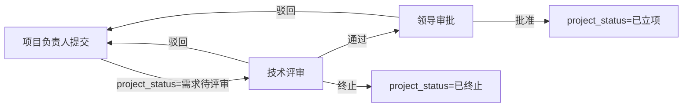
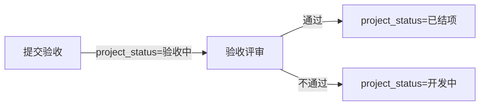
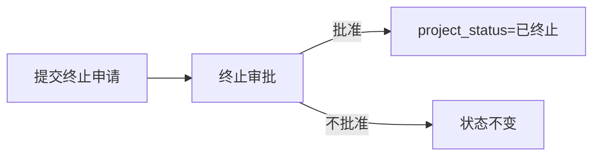

# 科创项目管理 - 开发设计文档

> 生成时间：2026-08-28
> 依据：`科创项目管理/01-需求文档.md`
> 状态：待确认

---

## 一、需求映射

| 需求编号 | 功能模块 | 对应泛微能力 | 执行方式 | 备注 |
|---------|---------|------------|---------|------|
| F1 | 项目库（总览） | 建模引擎：查询列表 + 快捷搜索 + 菜单 | SDK 自动化 | 查询页面 + 快捷搜索 + 菜单入口 |
| F2 | 项目申报 | 建模引擎：表单 + 模块 + 布局 | SDK 自动化 | 表单字段 + 新建/编辑页面 |
| F3 | 技术评审 | 流程引擎：审批流程 | 手动配置 | OA 管理后台配置流程节点 |
| F4 | 领导审批 | 流程引擎：审批流程 | 手动配置 | OA 管理后台配置流程节点 |
| F5 | 开发执行 | 建模引擎：模块（编辑模式） | SDK 自动化 | 编辑页面更新进度/里程碑 |
| F6 | 验收结项 | 流程引擎 + 建模引擎 | 混合（SDK + 手动） | 验收数据用表单，审批用流程 |
| F7 | 项目统计 | 建模引擎：查询列表（多视图） | SDK 自动化 | 按类型/状态/部门分别建查询 |

---

## 二、数据模型

> 完整复制 `02-数据结构设计.md` 中的表结构字段清单。

### 2.1 表结构

#### uf_kc_project — 科创项目主表

| 字段名 | 字段类型 | OA建模类型 | 必填 | 浏览框/选项 | 说明 |
|--------|---------|-----------|------|------------|------|
| id | int | - | 是 | - | 主键 |
| project_code | varchar(50) | 单行文本框 | 是 | - | 项目编号 |
| project_name | varchar(200) | 单行文本框 | 是 | - | 项目名称 |
| project_type | varchar(100) | 选择框 | 是 | 新产品研发/技术预研攻关/技术改造优化/工艺改进 | 项目类型 |
| project_level | varchar(100) | 选择框 | 是 | 公司级/部门级 | 项目级别 |
| apply_dept_id | int | 浏览框 | 是 | browser_id=4 | 申请部门 |
| project_manager_id | int | 浏览框 | 是 | browser_id=1 | 项目负责人 |
| plan_start_date | varchar(10) | 日期浏览框 | 是 | - | 预计开始日期 |
| plan_end_date | varchar(10) | 日期浏览框 | 是 | - | 预计结束日期 |
| project_status | varchar(100) | 选择框 | 是 | 草稿/需求待评审/技术评审中/领导审批中/已立项/开发中/验收中/已结项/已终止 | 项目状态 |
| project_background | text | 多行文本框 | 否 | - | 项目背景与目标 |
| tech_solution | text | 多行文本框 | 否 | - | 技术方案概述 |
| expected_result | text | 多行文本框 | 否 | - | 预期成果 |
| budget_amount | decimal(15,2) | 金额框 | 是 | - | 预算金额 |
| progress_percent | int | 整数 | 否 | - | 项目进度（0-100） |
| change_record | text | 多行文本框 | 否 | - | 变更记录 |
| actual_cost | decimal(15,2) | 金额框 | 否 | - | 实际花费 |
| cost_deviation_reason | text | 多行文本框 | 否 | - | 偏差原因说明 |
| accept_summary | text | 多行文本框 | 否 | - | 验收自评总结 |
| deliverables | text | 多行文本框 | 否 | - | 成果物清单 |
| project_attachment | varchar(500) | 附件上传 | 否 | - | 项目附件 |

#### uf_kc_milestone — 项目里程碑表

| 字段名 | 字段类型 | OA建模类型 | 必填 | 浏览框/选项 | 说明 |
|--------|---------|-----------|------|------------|------|
| id | int | - | 是 | - | 主键 |
| project_id | int | 浏览框 | 是 | 自定义浏览框：项目浏览框 | 关联科创项目 |
| milestone_name | varchar(200) | 单行文本框 | 是 | - | 里程碑名称 |
| plan_date | varchar(10) | 日期浏览框 | 是 | - | 计划完成日期 |
| actual_date | varchar(10) | 日期浏览框 | 否 | - | 实际完成日期 |
| milestone_status | varchar(100) | 选择框 | 是 | 未完成/已完成/已延期 | 里程碑状态 |
| delay_reason | text | 多行文本框 | 否 | - | 延期原因说明 |

### 2.2 表间关联

| 主表 | 关联字段 | 从表 | 关联字段 | 说明 |
|------|---------|------|---------|------|
| uf_kc_project | id | uf_kc_milestone | project_id | 一对多：一个项目有多个里程碑 |

---

## 三、执行步骤

### 步骤 1：创建应用"科创项目管理"

- **对应功能：** 全部
- **执行方式：** SDK (`modeling_create_app`)
- **具体操作：**
  ```
  参数：
  - app_name: "科创项目管理"
  - parent_id: 1085（AI实践应用）
  ```
- **预期结果：** 返回 app_id
- **验证方式：** `modeling_list_apps` 确认应用已创建

---

### 步骤 2：创建表单"科创项目" (uf_kc_project)

- **对应功能：** F1, F2, F5, F6
- **执行方式：** SDK (`form_create_form`)
- **参数：**
  - form_name: "科创项目"
  - app_id: {步骤1产出}
  - table_name: "uf_kc_project"
  - fields:
    ```json
    [
      {"name": "project_code", "label": "项目编号", "type": "text", "length": 50},
      {"name": "project_name", "label": "项目名称", "type": "text", "length": 200},
      {"name": "project_type", "label": "项目类型", "type": "dropdown", "options": ["新产品研发", "技术预研攻关", "技术改造优化", "工艺改进"]},
      {"name": "project_level", "label": "项目级别", "type": "dropdown", "options": ["公司级", "部门级"]},
      {"name": "apply_dept_id", "label": "申请部门", "type": "browser", "browser_id": 4},
      {"name": "project_manager_id", "label": "项目负责人", "type": "browser", "browser_id": 1},
      {"name": "plan_start_date", "label": "预计开始日期", "type": "text", "length": 10},
      {"name": "plan_end_date", "label": "预计结束日期", "type": "text", "length": 10},
      {"name": "project_status", "label": "项目状态", "type": "dropdown", "options": ["草稿", "需求待评审", "技术评审中", "领导审批中", "已立项", "开发中", "验收中", "已结项", "已终止"]},
      {"name": "project_background", "label": "项目背景与目标", "type": "textarea"},
      {"name": "tech_solution", "label": "技术方案概述", "type": "textarea"},
      {"name": "expected_result", "label": "预期成果", "type": "textarea"},
      {"name": "budget_amount", "label": "预算金额", "type": "float", "db_type": "decimal(15,2)"},
      {"name": "progress_percent", "label": "项目进度(%)", "type": "integer"},
      {"name": "change_record", "label": "变更记录", "type": "textarea"},
      {"name": "actual_cost", "label": "实际花费", "type": "float", "db_type": "decimal(15,2)"},
      {"name": "cost_deviation_reason", "label": "预算偏差原因说明", "type": "textarea"},
      {"name": "accept_summary", "label": "验收自评总结", "type": "textarea"},
      {"name": "deliverables", "label": "成果物清单", "type": "textarea"},
      {"name": "project_attachment", "label": "项目附件", "type": "file"}
    ]
    ```
- **预期结果：** 返回 form_id < 0，物理表 uf_kc_project 创建成功
- **验证方式：** `form_list_form_fields` 确认字段数量为 20 个

---

### 步骤 3：刷新 Label 缓存

- **执行方式：** SDK (`cache_refresh_label_cache`)
- **预期结果：** 缓存刷新成功
- **验证方式：** 表单字段标签在页面上正确显示中文

---

### 步骤 4：创建自定义浏览框"项目浏览框"

- **对应功能：** F1
- **执行方式：** SDK (`browser_create_browser`)
- **参数：**
  - browser_name: "项目浏览框"
  - form_id: {步骤2产出}
  - app_id: {步骤1产出}
  - default_filter: "project_status<>'草稿'"
  - page_size: 10
  - fields:
    ```json
    [
      {"fieldname": "project_name", "istitle": 1, "isquery": 1, "displayorder": 0, "colwidth": 200},
      {"fieldname": "project_code", "isquery": 1, "displayorder": 1, "colwidth": 120},
      {"fieldname": "project_type", "displayorder": 2, "colwidth": 100},
      {"fieldname": "project_status", "isquery": 1, "displayorder": 3, "colwidth": 80},
      {"fieldname": "project_manager_id", "displayorder": 4, "colwidth": 100}
    ]
    ```
- **思考点分析：**
  - 展示字段：项目名称（核心辨识）、项目编号（唯一编码）、项目类型、项目状态、项目负责人 — 5 个够用
  - 链接字段：项目名称（istitle=1），文本类型，选最代表性的
  - 查询字段：项目名称、项目编号、项目状态 — 能缩小范围，3 个
  - 默认过滤：排除草稿状态的项目（草稿不应被里程碑引用）
- **预期结果：** 浏览框创建成功
- **验证方式：** `browser_list_browsers` 确认浏览框已创建

---

### 步骤 5：创建表单"项目里程碑" (uf_kc_milestone)

- **对应功能：** F5
- **执行方式：** SDK (`form_create_form`)
- **参数：**
  - form_name: "项目里程碑"
  - app_id: {步骤1产出}
  - table_name: "uf_kc_milestone"
  - fields:
    ```json
    [
      {"name": "project_id", "label": "关联项目", "type": "browser", "browser_name": "项目浏览框"},
      {"name": "milestone_name", "label": "里程碑名称", "type": "text", "length": 200},
      {"name": "plan_date", "label": "计划完成日期", "type": "text", "length": 10},
      {"name": "actual_date", "label": "实际完成日期", "type": "text", "length": 10},
      {"name": "milestone_status", "label": "里程碑状态", "type": "dropdown", "options": ["未完成", "已完成", "已延期"]},
      {"name": "delay_reason", "label": "延期原因说明", "type": "textarea"}
    ]
    ```
- **预期结果：** 返回 form_id < 0，物理表 uf_kc_milestone 创建成功
- **验证方式：** `form_list_form_fields` 确认字段数量为 6 个，project_id 字段类型为自定义浏览框（type=161）

---

### 步骤 6：刷新 Label 缓存

- **执行方式：** SDK (`cache_refresh_label_cache`)

---

### 步骤 7：创建模块"科创项目"

- **对应功能：** F1, F2, F5, F6
- **执行方式：** SDK (`module_create_module`)
- **参数：**
  - module_name: "科创项目"
  - form_id: {步骤2产出}
  - app_id: {步骤1产出}
- **预期结果：** 返回 module_id，自动产生三种布局（查看/新建/编辑）+ 9 条默认权限
- **验证方式：** `module_list_modules` 确认模块已创建

---

### 步骤 8：创建模块"项目里程碑"

- **对应功能：** F5
- **执行方式：** SDK (`module_create_module`)
- **参数：**
  - module_name: "项目里程碑"
  - form_id: {步骤5产出}
  - app_id: {步骤1产出}
- **预期结果：** 返回 module_id
- **验证方式：** `module_list_modules` 确认

---

### 步骤 9：创建查询"科创项目列表" + 保存显示字段

- **对应功能：** F1
- **执行方式：** SDK (`list_create_query` + `list_save_formfields`)

**9a. 创建查询：**
- query_name: "科创项目列表"
- module_id: {步骤7产出}
- description: "所有研发项目的统一管理列表"

**9b. 保存显示字段：**
```json
[
  {"fieldname": "project_code", "showorder": 1, "colwidth": 5, "isquery": 1, "queryorder": 1, "isadvanced": 1, "issortable": 1, "sorttype": "a", "sortpriority": 1, "linktype": "form"},
  {"fieldname": "project_name", "showorder": 2, "colwidth": 8, "isquery": 1, "queryorder": 2, "isadvanced": 1, "issortable": 0, "linktype": "form"},
  {"fieldname": "project_type", "showorder": 3, "colwidth": 5, "isquery": 1, "queryorder": 3, "isadvanced": 0, "issortable": 0, "linktype": "form"},
  {"fieldname": "project_level", "showorder": 4, "colwidth": 4, "isquery": 0, "isadvanced": 0, "issortable": 0, "linktype": "form"},
  {"fieldname": "apply_dept_id", "showorder": 5, "colwidth": 5, "isquery": 1, "queryorder": 4, "isadvanced": 0, "issortable": 0, "linktype": "form"},
  {"fieldname": "project_manager_id", "showorder": 6, "colwidth": 5, "isquery": 1, "queryorder": 5, "isadvanced": 0, "issortable": 0, "linktype": "form"},
  {"fieldname": "project_status", "showorder": 7, "colwidth": 4, "isquery": 1, "queryorder": 6, "isadvanced": 0, "issortable": 0, "linktype": "form"},
  {"fieldname": "plan_start_date", "showorder": 8, "colwidth": 5, "isquery": 0, "isadvanced": 0, "issortable": 1, "sorttype": "a", "sortpriority": 2, "linktype": "form"},
  {"fieldname": "plan_end_date", "showorder": 9, "colwidth": 5, "isquery": 0, "isadvanced": 0, "issortable": 1, "sorttype": "a", "sortpriority": 3, "linktype": "form"},
  {"fieldname": "progress_percent", "showorder": 10, "colwidth": 4, "isquery": 0, "isadvanced": 0, "issortable": 0, "linktype": "form"},
  {"fieldname": "budget_amount", "showorder": 11, "colwidth": 5, "isquery": 0, "isadvanced": 0, "issortable": 1, "sorttype": "d", "linktype": "form"},
  {"fieldname": "actual_cost", "showorder": 12, "colwidth": 5, "isquery": 0, "isadvanced": 0, "issortable": 0, "linktype": "form"}
]
```

**思考点分析：**
- 显示字段：12 个核心字段，覆盖基本信息+时间+状态+预算
- 查询条件（isquery=1）：项目编号、项目名称、项目类型、申请部门、项目负责人、项目状态 — 6 个高频筛选
- 高级查询（isadvanced=1）：项目编号和名称开启模糊匹配
- 排序：项目编号升序（默认），预计开始日期和预计结束日期可排序

- **预期结果：** 查询创建成功，显示字段配置保存成功
- **验证方式：** `list_list_queries` 和 `list_get_formfields` 确认

---

### 步骤 10：创建查询"里程碑列表" + 保存显示字段

- **对应功能：** F5
- **执行方式：** SDK (`list_create_query` + `list_save_formfields`)

**10a. 创建查询：**
- query_name: "里程碑列表"
- module_id: {步骤8产出}
- description: "项目里程碑管理列表"

**10b. 保存显示字段：**
```json
[
  {"fieldname": "project_id", "showorder": 1, "colwidth": 8, "isquery": 1, "queryorder": 1, "isadvanced": 0, "issortable": 0, "linktype": "form"},
  {"fieldname": "milestone_name", "showorder": 2, "colwidth": 8, "isquery": 1, "queryorder": 2, "isadvanced": 1, "issortable": 0, "linktype": "form"},
  {"fieldname": "plan_date", "showorder": 3, "colwidth": 5, "isquery": 0, "isadvanced": 0, "issortable": 1, "sorttype": "a", "sortpriority": 1, "linktype": "form"},
  {"fieldname": "actual_date", "showorder": 4, "colwidth": 5, "isquery": 0, "isadvanced": 0, "issortable": 0, "linktype": "form"},
  {"fieldname": "milestone_status", "showorder": 5, "colwidth": 4, "isquery": 1, "queryorder": 3, "isadvanced": 0, "issortable": 0, "linktype": "form"},
  {"fieldname": "delay_reason", "showorder": 6, "colwidth": 8, "isquery": 0, "isadvanced": 0, "issortable": 0, "linktype": "form"}
]
```

- **预期结果：** 查询创建成功
- **验证方式：** `list_list_queries` 确认

---

### 步骤 11：配置快捷搜索（科创项目列表）

- **对应功能：** F1
- **执行方式：** SDK (`quicksearch_create_quicksearch_setting` + `quicksearch_add_quicksearch_condition`)

**11a. 创建快捷搜索配置：**
- query_id: {步骤9产出}

**11b. 添加搜索条件：**

**思考点分析：**
- 谁在查：项目负责人、管理员、技术评审人
- 怎么搜：按项目名称搜、按状态筛、按类型筛
- 选几个：4 个 — 名称、状态、类型、负责人

```json
[
  {"fieldname": "project_name", "customname": "项目名称", "showorder": 1},
  {"fieldname": "project_status", "customname": "项目状态", "showorder": 2},
  {"fieldname": "project_type", "customname": "项目类型", "showorder": 3},
  {"fieldname": "project_manager_id", "customname": "项目负责人", "showorder": 4}
]
```

- **预期结果：** 快捷搜索配置保存成功
- **验证方式：** `quicksearch_list_quicksearch_conditions` 确认 4 个条件

---

### 步骤 12：配置快捷搜索（里程碑列表）

- **对应功能：** F5
- **执行方式：** SDK (`quicksearch_create_quicksearch_setting` + `quicksearch_add_quicksearch_condition`)

**12a. 创建快捷搜索配置：**
- query_id: {步骤10产出}

**12b. 添加搜索条件：**

```json
[
  {"fieldname": "milestone_name", "customname": "里程碑名称", "showorder": 1},
  {"fieldname": "project_id", "customname": "关联项目", "showorder": 2},
  {"fieldname": "milestone_status", "customname": "里程碑状态", "showorder": 3}
]
```

- **预期结果：** 快捷搜索配置保存成功

---

### 步骤 13：配置布局（科创项目模块）

- **对应功能：** F2, F5, F6
- **执行方式：** SDK (`layout_generate_layout_json` + `layout_insert_layout`)

**布局分组配置（4 组）：**

```json
{
  "groups": [
    {
      "group_name": "基础信息",
      "fields": ["project_code", "project_name", "project_type", "project_level", "apply_dept_id", "project_manager_id", "project_status"],
      "required_fields": ["project_code", "project_name", "project_type", "project_level", "apply_dept_id", "project_manager_id", "project_status"]
    },
    {
      "group_name": "时间计划",
      "fields": ["plan_start_date", "plan_end_date"],
      "required_fields": ["plan_start_date", "plan_end_date"]
    },
    {
      "group_name": "项目描述",
      "fields": ["project_background", "tech_solution", "expected_result"],
      "required_fields": []
    },
    {
      "group_name": "预算与执行",
      "fields": ["budget_amount", "progress_percent", "change_record", "actual_cost", "cost_deviation_reason", "accept_summary", "deliverables", "project_attachment"],
      "required_fields": ["budget_amount"]
    }
  ]
}
```

**必填理由：**
- 基础信息全部必填：项目名称、类型、级别、部门、负责人是核心识别信息，状态用于流程控制
- 时间计划必填：开始/结束日期是项目排期的基础，流程中需要校验结束日期 > 开始日期
- 项目描述选填：背景、方案、成果可在申报时逐步完善
- 预算金额必填：影响验收时的偏差计算

- **预期结果：** 布局配置保存到新建/编辑/查看三种布局
- **验证方式：** 在模块的新建页面确认字段分组正确

---

### 步骤 14：配置布局（里程碑模块）

- **对应功能：** F5
- **执行方式：** SDK (`layout_generate_layout_json` + `layout_insert_layout`)

**布局分组配置（2 组）：**

```json
{
  "groups": [
    {
      "group_name": "基础信息",
      "fields": ["project_id", "milestone_name", "milestone_status"],
      "required_fields": ["project_id", "milestone_name", "milestone_status"]
    },
    {
      "group_name": "时间管理",
      "fields": ["plan_date", "actual_date", "delay_reason"],
      "required_fields": ["plan_date"]
    }
  ]
}
```

- **预期结果：** 布局配置保存成功

---

### 步骤 15：创建菜单

- **对应功能：** F1, F5
- **执行方式：** SDK (`menu_create_menu` + `menu_create_sub_menus`)

**15a. 创建目录"科创项目管理"：**
- menu_name: "科创项目管理"
- parent_id: 0（顶级菜单，或根据实际菜单树确定位置）
- menu_type: 1（目录）

**15b. 创建子菜单：**
```json
[
  {"menu_name": "项目库", "menu_type": 2, "query_id": {步骤9产出}},
  {"menu_name": "里程碑管理", "menu_type": 2, "query_id": {步骤10产出}}
]
```

- **预期结果：** 菜单创建成功，左侧门户出现"科创项目管理 > 项目库 / 里程碑管理"
- **验证方式：** `menu_get_menu_tree` 确认菜单结构

---

### 步骤 16：手动配置审批流程（技术评审→领导审批→验收评审）

- **对应功能：** F3, F4, F6
- **执行方式：** 手动（OA 管理后台）
- **具体操作：**

**16a. 创建"科创项目立项审批"流程：**
- 流程节点：
  1. **提交节点** — 项目负责人填写立项申请
  2. **技术评审节点** — 技术总监/指定评审人评审
     - 签字意见：必填
     - 操作选项：通过/驳回/终止
     - 通过后 → 领导审批；驳回 → 退回提交节点；终止 → 流程结束
  3. **领导审批节点** — 分管领导/总经理审批
     - 可查看技术评审意见
     - 操作选项：批准/驳回
     - 批准后 → 流程结束（项目状态变为"已立项"）；驳回 → 退回提交节点

- **状态更新规则（通过流程 Action 实现）：**
  - 提交时：project_status = "需求待评审"
  - 技术评审通过时：project_status = "领导审批中"
  - 技术评审驳回时：project_status = "草稿"
  - 技术评审终止时：project_status = "已终止"
  - 领导批准时：project_status = "已立项"
  - 领导驳回时：project_status = "草稿"

**16b. 创建"项目验收评审"流程：**
- 流程节点：
  1. **提交验收节点** — 项目负责人填写验收信息
  2. **验收评审节点** — 验收评审人审批
     - 操作选项：通过/不通过
     - 通过 → project_status = "已结项"
     - 不通过 → project_status = "开发中"

**16c. 创建"项目终止审批"流程：**
- 流程节点：
  1. **提交终止申请** — 项目负责人发起
  2. **终止审批** — 审批领导决策
     - 批准 → project_status = "已终止"
     - 不批准 → project_status 不变

- **预期结果：** 三个审批流程配置完成
- **验证方式：** 在 OA 管理后台确认流程节点和流转规则

---

### 步骤 17：手动配置角色权限

- **对应功能：** 全部
- **执行方式：** 手动（OA 管理后台）
- **具体操作：**

**17a. 配置模块权限：**

| 角色 | 科创项目模块 | 里程碑模块 |
|------|------------|-----------|
| 项目负责人 | 新建/编辑/查看（自己负责的） | 新建/编辑/查看（自己项目的） |
| 技术评审人 | 查看（待评审的） | 查看 |
| 审批领导 | 查看（待审批的） | 查看 |
| 项目管理员 | 全部权限 | 全部权限 |

**17b. 配置菜单可见性：**

| 菜单 | 可见角色 |
|------|---------|
| 项目库 | 项目负责人、技术评审人、审批领导、项目管理员 |
| 里程碑管理 | 项目负责人、项目管理员 |

---

## 四、前端效果展示

### 4.1 菜单配置

- **菜单位置：** 科创项目管理 > 项目库 / 里程碑管理
- **图标：** 使用系统默认图标
- **权限：** 见步骤 17b

### 4.2 表单布局

**科创项目 — 新建页面：**

```
┌─ 基础信息 ─────────────────────────────────┐
│  项目编号：[________]    项目名称：[________] │
│  项目类型：[▼ 请选择]    项目级别：[▼ 请选择] │
│  申请部门：[选择部门]    项目负责人：[选择人员] │
│  项目状态：[▼ 草稿]                          │
└──────────────────────────────────────────────┘

┌─ 时间计划 ─────────────────────────────────┐
│  预计开始日期：[选择日期]                      │
│  预计结束日期：[选择日期]                      │
└──────────────────────────────────────────────┘

┌─ 项目描述 ─────────────────────────────────┐
│  项目背景与目标：                              │
│  [多行文本框                                ] │
│  技术方案概述：                                │
│  [多行文本框                                ] │
│  预期成果：                                    │
│  [多行文本框                                ] │
└──────────────────────────────────────────────┘

┌─ 预算与执行 ───────────────────────────────┐
│  预算金额：[________]    项目进度(%)：[______] │
│  变更记录：                                  │
│  [多行文本框                                ] │
│  实际花费：[________]                        │
│  预算偏差原因说明：                            │
│  [多行文本框                                ] │
│  验收自评总结：                                │
│  [多行文本框                                ] │
│  成果物清单：                                  │
│  [多行文本框                                ] │
│  项目附件：[上传文件]                          │
└──────────────────────────────────────────────┘
```

**项目里程碑 — 新建页面：**

```
┌─ 基础信息 ─────────────────────────────────┐
│  关联项目：[项目浏览框选择]                    │
│  里程碑名称：[________________]              │
│  里程碑状态：[▼ 未完成]                      │
└──────────────────────────────────────────────┘

┌─ 时间管理 ─────────────────────────────────┐
│  计划完成日期：[选择日期]                      │
│  实际完成日期：[选择日期]                      │
│  延期原因说明：                                │
│  [多行文本框                                ] │
└──────────────────────────────────────────────┘
```

### 4.3 查询页面

**科创项目列表：**

- **快捷搜索栏：** [项目名称] [项目状态] [项目类型] [项目负责人]
- **列表列：** 项目编号、项目名称、项目类型、项目级别、申请部门、项目负责人、项目状态、预计开始日期、预计结束日期、项目进度、预算金额、实际花费
- **操作按钮：** 新建、编辑、删除（管理员）、导出
- **默认排序：** 预计开始日期降序

**里程碑列表：**

- **快捷搜索栏：** [里程碑名称] [关联项目] [里程碑状态]
- **列表列：** 关联项目、里程碑名称、计划完成日期、实际完成日期、里程碑状态、延期原因说明
- **操作按钮：** 新建、编辑、删除
- **默认排序：** 计划完成日期升序

### 4.4 流程节点

**立项审批流程：**



**验收评审流程：**



**终止审批流程：**



---

## 五、不支持的功能

| 需求编号 | 功能 | 原因 | 替代方案 |
|---------|------|------|---------|
| F2 | 项目编号自动生成 | 建模引擎不支持编号自动生成规则 | 通过流程引擎 Action 的 Java 代码实现，或手动填写 |
| F5 | 里程碑延期自动标记 | 泛微不支持定时任务自动检测日期 | 在查询时动态判断（实际完成日期 > 计划完成日期 → 显示延期标记），或项目负责人手动更新状态 |
| F7 | 统计饼图/图表 | 建模引擎不支持图表渲染 | 通过多个查询列表（按类型/状态/部门分组）近似实现；如需图表，导出 Excel 后在外部工具处理 |
| F7 | 实时通知 | 泛微无 WebSocket 推送 | 通过流程引擎的待办通知实现（流程流转时自动通知相关人员） |
